# คลังเวิร์กโฟลว์สำหรับนักพัฒนาที่ใช้ AI

[](https://opensource.org/licenses/Apache-2.0)
[](./prd-driven-workflow)
[](./review-driven-workflow)
[](README.md)
[](README-TH.md)

> 🚀 **เวิร์กโฟลว์ระดับองค์กรที่ขับเคลื่อนด้วย AI** สำหรับการทำงานอัตโนมัติในกระบวนการพัฒนาซอฟต์แวร์ ตั้งแต่การกำหนดความต้องการจนถึงการนำไปใช้งาน

[English](README.md) | [ภาษาไทย](README-TH.md)

---

## 📋 สารบัญ

- [ภาพรวม](#-ภาพรวม)
- [คุณสมบัติหลัก](#-คุณสมบัติหลัก)
- [ระบบเวิร์กโฟลว์](#-ระบบเวิร์กโฟลว์)
- [เริ่มต้นใช้งานอย่างรวดเร็ว](#-เริ่มต้นใช้งานอย่างรวดเร็ว)
- [การรวมเข้ากับโปรเจคที่มีอยู่](#-การรวมเข้ากับโปรเจคที่มีอยู่)
- [สถาปัตยกรรม](#-สถาปัตยกรรม)
- [คำสั่งอ้างอิง](#-คำสั่งอ้างอิง)
- [ข้อกำหนดเบื้องต้น](#-ข้อกำหนดเบื้องต้น)
- [การติดตั้ง](#-การติดตั้ง)
- [ตัวอย่างการใช้งาน](#-ตัวอย่างการใช้งาน)
- [การมีส่วนร่วม](#-การมีส่วนร่วม)
- [สัญญาอนุญาต](#-สัญญาอนุญาต)

## 🎯 ภาพรวม

**คลังเวิร์กโฟลว์สำหรับนักพัฒนาที่ใช้ AI** เป็นชุดเวิร์กโฟลว์ที่ครอบคลุมในรูปแบบ markdown ที่ออกแบบมาเพื่อปฏิวัติวิธีการทำงานของทีมพัฒนากับผู้ช่วย AI เวิร์กโฟลว์เหล่านี้มอบกระบวนการที่มีโครงสร้างและทำซ้ำได้สำหรับงานพัฒนาทั่วไป ช่วยให้มั่นใจในความสม่ำเสมอ คุณภาพ และประสิทธิภาพตลอดวงจรการพัฒนาทั้งหมดของคุณ

### ทำไมต้องใช้เวิร์กโฟลว์เหล่านี้?

- **🤖 ออกแบบเพื่อ AI**: สร้างขึ้นเฉพาะสำหรับผู้ช่วย AI เช่น Claude, ChatGPT และ Cursor
- **📊 กระบวนการที่มีโครงสร้าง**: เปลี่ยนการพัฒนาแบบไม่เป็นระบบให้เป็นเวิร์กโฟลว์ที่เป็นระบบและทำซ้ำได้
- **🔍 การตรวจสอบหลายมุมมอง**: รับการวิเคราะห์โค้ดที่ครอบคลุมจากผู้ตรวจสอบเฉพาะทาง
- **👥 ขยายขนาดทีม**: เหมาะสำหรับการปฐมนิเทศนักพัฒนาจูเนียร์และรักษามาตรฐาน
- **🔄 การรวมกับ GitLab**: รวมเข้ากับ pipeline การพัฒนาที่มีอยู่ของคุณได้อย่างราบรื่น

## ✨ คุณสมบัติหลัก

### ความสามารถหลัก

| คุณสมบัติ | คำอธิบาย | ประโยชน์ |
|----------|----------|----------|
| **การสร้าง PRD** | การรวบรวมความต้องการแบบโต้ตอบด้วย AI | ข้อกำหนดที่ชัดเจนไม่คลุมเครือ |
| **การแบ่งงาน** | แบ่ง PRD เป็นงานย่อยอัตโนมัติ | งานที่จัดการและติดตามได้ |
| **การตรวจสอบโดยผู้เชี่ยวชาญ** | ผู้ตรวจสอบเฉพาะทาง 5 คนสำหรับแง่มุมต่างๆ | การประกันคุณภาพที่ครอบคลุม |
| **การทำงานอัตโนมัติของ GitLab** | รวมโดยตรงกับ issues และ MRs | การจัดการเวิร์กโฟลว์ที่มีประสิทธิภาพ |
| **ข้อเสนอแนะเชิงการศึกษา** | การให้คำปรึกษาผ่านการตรวจสอบโค้ด | พัฒนาทักษะของทีม |
| **รองรับสองภาษา** | เอกสารภาษาอังกฤษและภาษาไทยแบบเต็ม | ทีมทั่วโลกสามารถเข้าถึงได้ |

## 🔧 ระบบเวิร์กโฟลว์

### 1. เวิร์กโฟลว์ที่ขับเคลื่อนด้วย PRD

เปลี่ยนไอเดียเป็นการนำไปใช้ผ่านข้อกำหนดที่มีโครงสร้าง:

```mermaid
graph LR
    A[ไอเดีย] --> B[สร้าง PRD]
    B --> C[สร้างงาน]
    C --> D[ประมวลผลงาน]
    D --> E[การนำไปใช้]
```



**ส่วนประกอบ:**
- `01-create-prd.md` - การสร้าง PRD แบบโต้ตอบพร้อมคำถามเพื่อความชัดเจน
- `02-generate-tasks.md` - การสร้างงานอัตโนมัติจาก PRDs
- `03-process-task-list.md` - การดำเนินการและจัดการงาน

**ประโยชน์หลัก:**
- ลดความคลุมเครือในข้อกำหนด
- สร้างงานที่ปฏิบัติได้และเป็นมิตรกับนักพัฒนา
- รักษาการติดตามได้จากไอเดียสู่การนำไปใช้

### 2. เวิร์กโฟลว์ที่ขับเคลื่อนด้วยการตรวจสอบ

ระบบตรวจสอบโค้ดที่ครอบคลุมพร้อมการวิเคราะห์เฉพาะทาง:

```mermaid
graph TD
    A[การเปลี่ยนแปลงโค้ด] --> B[การตรวจสอบ Branch]
    B --> C{ผู้ตรวจสอบเฉพาะทาง}
    C --> D[คุณภาพโค้ด]
    C --> E[ความปลอดภัย]
    C --> F[ประสิทธิภาพ]
    C --> G[การออกแบบ API]
    C --> H[การศึกษา]
    D --> I[รายงานที่ครอบคลุม]
    E --> I
    F --> I
    G --> I
    H --> I
    I --> J[ข้อเสนอแนะ GitLab]
```



**ผู้ตรวจสอบเฉพาะทาง:**

| ผู้ตรวจสอบ | พื้นที่โฟกัส | ใช้อัตโนมัติกับ |
|------------|-------------|----------------|
| `code-reviewer` | คุณภาพทั่วไป รูปแบบ การบำรุงรักษา | ไฟล์โค้ดทั้งหมด |
| `security-reviewer` | ช่องโหว่ การปฏิบัติตาม OWASP | ไฟล์ที่เกี่ยวกับความปลอดภัย |
| `performance-reviewer` | คอขวด โอกาสในการปรับปรุง | ไฟล์โค้ดทั้งหมด |
| `api-reviewer` | การออกแบบ RESTful ความสอดคล้อง | API endpoints |
| `mr-reviewer` | ข้อเสนอแนะเชิงการศึกษา การให้คำปรึกษา | เรียกใช้ด้วยตนเอง |

## 🚀 เริ่มต้นใช้งานอย่างรวดเร็ว

### การใช้งานพื้นฐาน

```bash
# 1. สร้าง PRD ใหม่สำหรับฟีเจอร์ของคุณ
# ใช้คู่มือเวิร์กโฟลว์ PRD กับผู้ช่วย AI ของคุณ

# 2. ดึง GitLab issues สำหรับการตรวจสอบ
@extract-issues

# 3. ตรวจสอบการนำ issue เฉพาะไปใช้
@branch-review #123

# 4. รันการตรวจสอบแบบครอบคลุมพร้อมโพสต์ไปยัง GitLab
@branch-review #123 --post
```

### การตรวจสอบแบบเฉพาะเจาะจง

```bash
# การตรวจสอบที่เน้นความปลอดภัย
@branch-review feature/authentication --security-focus

# การตรวจสอบการปรับปรุงประสิทธิภาพ
@branch-review feature/data-processing --performance-focus

# การตรวจสอบการออกแบบ API
@branch-review feature/rest-api --api-focus

# การตรวจสอบเชิงการศึกษาสำหรับนักพัฒนาจูเนียร์
@mr-reviewer https://gitlab.com/project/merge_requests/45
```

## 🔗 การรวมเข้ากับโปรเจคที่มีอยู่

### การใช้ Git Subtree (แนะนำ)

เพิ่มเวิร์กโฟลว์เหล่านี้ลงใน codebase ที่มีอยู่ของคุณโดยตรงโดยใช้ git subtree วิธีนี้ช่วยให้คุณ:
- เก็บเวิร์กโฟลว์ที่มีเวอร์ชันพร้อมกับโค้ดของคุณ
- ปรับแต่งเวิร์กโฟลว์สำหรับความต้องการเฉพาะของคุณ
- แบ่งปันการปรับปรุงกลับสู่ชุมชน
- หลีกเลี่ยงความซับซ้อนของ submodule

#### การเพิ่มเวิร์กโฟลว์ในโปรเจคของคุณ

```bash
# เพิ่มเป็นไดเรกทอรีที่ซ่อนอยู่ใน root ของโปรเจค
git subtree add --prefix=.ai-workflows \
  https://github.com/tkhongsap/ai-dev-workflow.git main --squash

# หรือเพิ่มในไดเรกทอรี tools เฉพาะ
git subtree add --prefix=tools/ai-workflows \
  https://github.com/tkhongsap/ai-dev-workflow.git main --squash

# สำหรับวิธีที่รวมเข้าด้วยกันมากขึ้น เพิ่มใน docs ของคุณ
git subtree add --prefix=docs/ai-workflows \
  https://github.com/tkhongsap/ai-dev-workflow.git main --squash
```

#### การอัปเดตเวิร์กโฟลว์

```bash
# ดึงการปรับปรุงล่าสุดจาก upstream
git subtree pull --prefix=.ai-workflows \
  https://github.com/tkhongsap/ai-dev-workflow.git main --squash

# สิ่งนี้จะรวมการอัปเดตในขณะที่รักษาการปรับแต่งของคุณ
```

#### การส่งการปรับปรุงกลับ

```bash
# สร้าง feature branch สำหรับการปรับปรุงของคุณ
git subtree push --prefix=.ai-workflows \
  https://github.com/tkhongsap/ai-dev-workflow.git feature/your-improvement

# จากนั้นสร้าง pull request จาก feature branch
```

#### แนวทางปฏิบัติที่ดีสำหรับการรวม Subtree

1. **เลือกตำแหน่งที่เหมาะสม**:
   - `.ai-workflows/` - ซ่อนอยู่ ไม่ทำให้ root ของโปรเจครก
   - `tools/workflows/` - จัดกลุ่มกับเครื่องมือพัฒนาอื่นๆ
   - `docs/workflows/` - ส่วนหนึ่งของโครงสร้างเอกสาร

2. **ปรับแต่งสำหรับโปรเจคของคุณ**:
   - แก้ไขกฎ MDC ให้ตรงกับมาตรฐานการเขียนโค้ดของคุณ
   - เพิ่มเกณฑ์การตรวจสอบเฉพาะโปรเจค
   - สร้างเวิร์กโฟลว์แบบกำหนดเอง

3. **จัดทำเอกสารการรวม**:
   ```markdown
   # ใน README.md ของโปรเจคคุณ
   ## เวิร์กโฟลว์ AI
   โปรเจคนี้รวมเวิร์กโฟลว์การพัฒนาที่ขับเคลื่อนด้วย AI ใน `.ai-workflows/`
   ดูคำแนะนำการใช้งานที่ `.ai-workflows/README.md`
   ```

4. **การปฐมนิเทศทีม**:
   - รวมการใช้งานเวิร์กโฟลว์ในเอกสารการปฐมนิเทศ
   - สร้างตัวอย่างเฉพาะโปรเจค
   - ตั้งค่าตัวแปรสภาพแวดล้อม GitLab

### ทางเลือก: Git Submodule

สำหรับทีมที่ชอบใช้ submodules:

```bash
# เพิ่มเป็น submodule
git submodule add https://github.com/tkhongsap/ai-dev-workflow.git .ai-workflows

# เริ่มต้นและอัปเดต
git submodule update --init --recursive
```

## 🏗️ สถาปัตยกรรม

### โครงสร้างไดเรกทอรี

```
ai-dev-workflow/
├── prd-driven-workflow/
│   ├── 01-create-prd.md           # คู่มือการสร้าง PRD
│   ├── 02-generate-tasks.md       # การสร้างงาน
│   ├── 03-process-task-list.md    # การประมวลผลงาน
│   └── *-replit.md                # เวอร์ชัน Replit
├── review-driven-workflow/
│   ├── review-workflow.mdc        # ตัวประสานงานหลัก
│   ├── extract-issues.mdc         # การรวม GitLab
│   ├── branch-review.mdc          # การวิเคราะห์ Branch
│   ├── code-reviewer.mdc          # คุณภาพโค้ด
│   ├── security-reviewer.mdc      # การวิเคราะห์ความปลอดภัย
│   ├── performance-reviewer.mdc   # การปรับประสิทธิภาพ
│   ├── api-reviewer.mdc           # การออกแบบ API
│   └── mr-reviewer.mdc            # การตรวจสอบเชิงการศึกษา
└── CLAUDE.md                       # คำแนะนำสำหรับผู้ช่วย AI
```

### ประเภทไฟล์

| นามสกุล | วัตถุประสงค์ | รูปแบบ |
|---------|-------------|--------|
| `.md` | เอกสารเวิร์กโฟลว์ | Markdown มาตรฐาน |
| `.mdc` | กฎการตรวจสอบพร้อมการทำงานอัตโนมัติ | Markdown + Front Matter |

### โครงสร้างกฎ MDC

```yaml
---
description: "คำอธิบายกฎ"
globs: ["**/*.py", "**/*.js"]  # รูปแบบการใช้อัตโนมัติ
alwaysApply: true               # ใช้กับไฟล์ทั้งหมด
---
# เนื้อหากฎและเกณฑ์การตรวจสอบ
```

## 📊 คำสั่งอ้างอิง

### คำสั่งเวิร์กโฟลว์

| คำสั่ง | คำอธิบาย | ตัวอย่าง |
|--------|----------|----------|
| `@extract-issues` | ดึง GitLab issues | `@extract-issues` |
| `@branch-review` | ตรวจสอบ branch/issue | `@branch-review #123` |
| `@code-reviewer` | ตรวจสอบคุณภาพโค้ด | เรียกใช้อัตโนมัติ |
| `@security-reviewer` | วิเคราะห์ความปลอดภัย | เรียกใช้อัตโนมัติ |
| `@performance-reviewer` | ตรวจสอบประสิทธิภาพ | เรียกใช้อัตโนมัติ |
| `@api-reviewer` | ตรวจสอบการออกแบบ API | เรียกใช้อัตโนมัติ |
| `@mr-reviewer` | การตรวจสอบเชิงการศึกษา | `@mr-reviewer <url>` |

### ตัวเลือกคำสั่ง

| ตัวเลือก | คำอธิบาย | การใช้งาน |
|----------|----------|-----------|
| `--post` | โพสต์ไปยัง GitLab | `@branch-review #123 --post` |
| `--security-focus` | เน้นความปลอดภัย | `@branch-review #123 --security-focus` |
| `--performance-focus` | เน้นประสิทธิภาพ | `@branch-review #123 --performance-focus` |
| `--api-focus` | เน้นการออกแบบ API | `@branch-review #123 --api-focus` |
| `--queue` | ประมวลผลคิวการตรวจสอบ | `@branch-review --queue` |

## 📋 ข้อกำหนดเบื้องต้น

### จำเป็น
- Git repository
- ผู้ช่วย AI (Claude, ChatGPT, Cursor ฯลฯ)
- โปรแกรมดู/แก้ไข Markdown

### ทางเลือก (สำหรับการรวม GitLab)
- บัญชี GitLab พร้อมการเข้าถึง API
- ตัวแปรสภาพแวดล้อม:
  ```bash
  export GITLAB_ACCESS_TOKEN="your_token"
  export GITLAB_PROJECT_ID="your_project_id"
  export GITLAB_URL="https://gitlab.yourdomain.com"  # ทางเลือก
  ```

## 💾 การติดตั้ง

### การติดตั้งมาตรฐาน

```bash
# โคลนจาก GitHub
git clone https://github.com/tkhongsap/ai-dev-workflow.git

# หรือโคลนจาก GitLab (ภายใน)
git clone https://gitlab.thaibevapp.com/thaibev-ai/ai-dev-tools-workflows/ai-dev-tasks.git ai-dev-workflow

# ไปยังไดเรกทอรี
cd ai-dev-workflow

# ตั้งค่าการรวม GitLab (ทางเลือก)
cp .env.example .env
# แก้ไข .env ด้วยข้อมูลรับรอง GitLab ของคุณ
```

### การติดตั้งแบบรวม

ดู [การรวมเข้ากับโปรเจคที่มีอยู่](#-การรวมเข้ากับโปรเจคที่มีอยู่) ด้านบน

## 📚 ตัวอย่างการใช้งาน

### ตัวอย่างที่ 1: การสร้างฟีเจอร์ใหม่

```bash
# 1. เริ่มต้นด้วยการสร้าง PRD
# บอก AI ของคุณ: "ฉันต้องการสร้าง PRD สำหรับฟีเจอร์การยืนยันตัวตนผู้ใช้"
# AI จะใช้ 01-create-prd.md เพื่อแนะนำคุณ

# 2. สร้างงานจาก PRD
# บอก AI ของคุณ: "สร้างงานจาก prd-authentication.md"
# AI จะสร้างรายการงานที่มีโครงสร้าง

# 3. ประมวลผลงาน
# บอก AI ของคุณ: "มาทำงานการยืนยันตัวตนกันเถอะ"
# AI จะทำงานแต่ละงานอย่างเป็นระบบจนเสร็จ
```

### ตัวอย่างที่ 2: การตรวจสอบ Feature Branch

```bash
# 1. ดึง issues ปัจจุบัน
@extract-issues

# 2. ตรวจสอบการนำไปใช้เฉพาะ
@branch-review #456 --post

# 3. ตรวจสอบการตรวจสอบที่สร้างขึ้น
cat workflow/review-456-2024-01-15.md
```

### ตัวอย่างที่ 3: การให้คำปรึกษานักพัฒนาจูเนียร์

```bash
# 1. นักพัฒนาจูเนียร์สร้าง MR
# 2. รันการตรวจสอบเชิงการศึกษา
@mr-reviewer https://gitlab.com/project/merge_requests/789

# 3. การตรวจสอบให้:
# - คำอธิบายโดยละเอียด
# - คำแนะนำแนวทางปฏิบัติที่ดี
# - แหล่งข้อมูลการเรียนรู้
# - การเสริมแรงเชิงบวก
```

## 🤝 การมีส่วนร่วม

เรายินดีรับการมีส่วนร่วม! นี่คือวิธีที่คุณสามารถช่วยได้:

### วิธีการมีส่วนร่วม

1. **เวิร์กโฟลว์ใหม่**: สร้างรูปแบบเวิร์กโฟลว์ใหม่
2. **การปรับปรุงเวิร์กโฟลว์**: ปรับปรุงเวิร์กโฟลว์ที่มีอยู่
3. **เอกสาร**: ปรับปรุงเอกสารและตัวอย่าง
4. **การแปล**: เพิ่มการรองรับภาษาใหม่
5. **เครื่องมือการรวม**: สร้างสคริปต์การรวม

### กระบวนการมีส่วนร่วม

1. Fork repository
2. สร้าง feature branch (`git checkout -b feature/amazing-feature`)
3. Commit การเปลี่ยนแปลงของคุณ (`git commit -m 'Add amazing feature'`)
4. Push ไปยัง branch (`git push origin feature/amazing-feature`)
5. เปิด Pull Request

### แนวทางการมีส่วนร่วม

- ปฏิบัติตามการจัดรูปแบบ markdown ที่มีอยู่
- รวมตัวอย่างในเอกสาร
- ทดสอบเวิร์กโฟลว์กับผู้ช่วย AI หลายตัว
- อัปเดตเอกสารทั้งภาษาอังกฤษและภาษาไทยหากเหมาะสม
- เพิ่มตัวคุณเองใน CONTRIBUTORS.md

## 📄 สัญญาอนุญาต

โปรเจคนี้อยู่ภายใต้สัญญาอนุญาต Apache License 2.0 - ดู [LICENSE](LICENSE) สำหรับรายละเอียด

### ความหมาย

✅ **คุณสามารถ:**
- ใช้เชิงพาณิชย์
- แก้ไขและแจกจ่าย
- ใช้ส่วนตัว
- ให้การรับประกัน

❌ **คุณไม่สามารถ:**
- ถือว่ารับผิดชอบ
- ใช้เครื่องหมายการค้า

📋 **คุณต้อง:**
- รวมลิขสิทธิ์
- รวมสัญญาอนุญาต
- ระบุการเปลี่ยนแปลง
- รวม NOTICE

---

## 🙏 กิตติกรรมประกาศ

- สร้างขึ้นสำหรับชุมชนนักพัฒนา
- ได้รับแรงบันดาลใจจากแนวทางปฏิบัติที่ดีจากบริษัทเทคโนโลยีชั้นนำ
- ออกแบบมาสำหรับการรวมผู้ช่วย AI อย่างราบรื่น

## 📮 การสนับสนุน

- **GitHub Issues**: [https://github.com/tkhongsap/ai-dev-workflow/issues](https://github.com/tkhongsap/ai-dev-workflow/issues)
- **GitHub Discussions**: [https://github.com/tkhongsap/ai-dev-workflow/discussions](https://github.com/tkhongsap/ai-dev-workflow/discussions)
- **GitLab Repository**: [https://gitlab.thaibevapp.com/thaibev-ai/ai-dev-tools-workflows/ai-dev-tasks](https://gitlab.thaibevapp.com/thaibev-ai/ai-dev-tools-workflows/ai-dev-tasks)

---

<div align="center">

**สร้างด้วย ❤️ สำหรับนักพัฒนาที่เชื่อมั่นในพลังของการพัฒนาด้วยความช่วยเหลือของ AI**

[⬆ กลับไปด้านบน](#คลังเวิร์กโฟลว์สำหรับนักพัฒนาที่ใช้-ai)

</div>