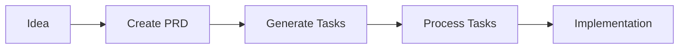
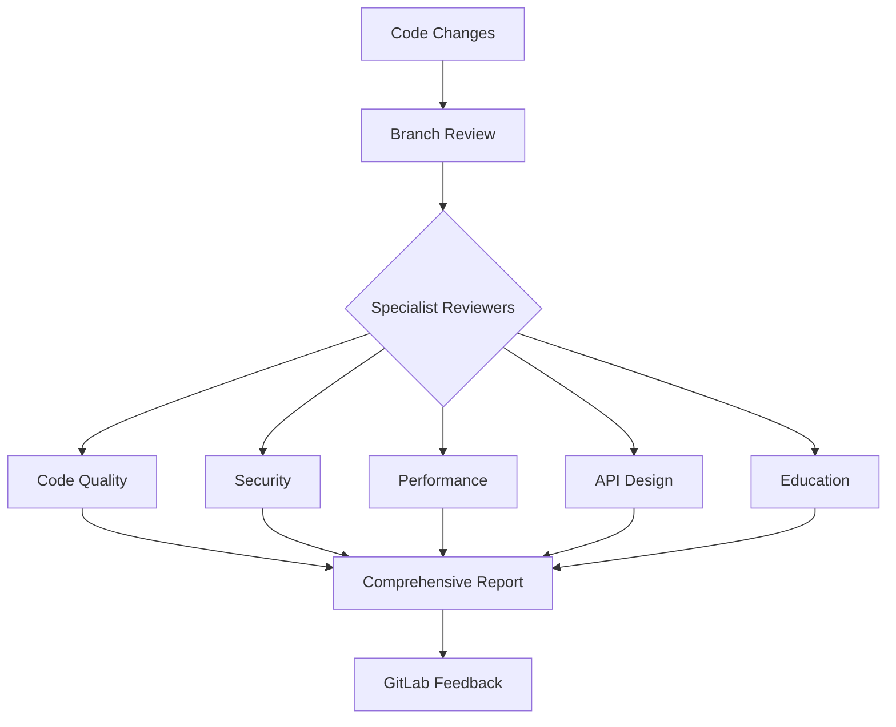

# AI Developer Workflow Collection

[](https://opensource.org/licenses/Apache-2.0)
[](./prd-driven-workflow)
[](./review-driven-workflow)
[](README.md)
[](README-TH.md)

> 🚀 **Enterprise-grade AI-powered workflows** for automating software development processes, from requirements to deployment.

[English](README.md) | [ภาษาไทย](README-TH.md)

---

## 📋 Table of Contents

- [Overview](#-overview)
- [Key Features](#-key-features)
- [Workflow Systems](#-workflow-systems)
- [Quick Start](#-quick-start)
- [Integration with Existing Projects](#-integration-with-existing-projects)
- [Architecture](#-architecture)
- [Command Reference](#-command-reference)
- [Prerequisites](#-prerequisites)
- [Installation](#-installation)
- [Usage Examples](#-usage-examples)
- [Contributing](#-contributing)
- [License](#-license)

## 🎯 Overview

The **AI Developer Workflow Collection** is a comprehensive suite of markdown-based workflows designed to revolutionize how development teams work with AI assistants. These workflows provide structured, repeatable processes for common development tasks, ensuring consistency, quality, and efficiency across your entire development lifecycle.

### Why Use These Workflows?

- **🤖 AI-First Design**: Built specifically for AI assistants like Claude, ChatGPT, and Cursor
- **📊 Structured Processes**: Transform ad-hoc development into systematic, repeatable workflows
- **🔍 Multi-Perspective Reviews**: Get comprehensive code analysis from specialized reviewers
- **👥 Team Scalability**: Perfect for onboarding junior developers and maintaining standards
- **🔄 GitLab Integration**: Seamless integration with your existing development pipeline

## ✨ Key Features

### Core Capabilities

| Feature | Description | Benefit |
|---------|-------------|---------|
| **PRD Generation** | Interactive requirements gathering with AI | Clear, unambiguous specifications |
| **Task Decomposition** | Automatic breakdown of PRDs into tasks | Manageable, trackable work items |
| **Multi-Specialist Review** | 5 specialized reviewers for different aspects | Comprehensive quality assurance |
| **GitLab Automation** | Direct integration with issues and MRs | Streamlined workflow management |
| **Educational Feedback** | Mentoring through code reviews | Team skill development |
| **Bilingual Support** | Full English and Thai documentation | Global team accessibility |

## 🔧 Workflow Systems

### 1. PRD-Driven Workflow

Transform ideas into implementation through structured requirements:



**Components:**
- `01-create-prd.md` - Interactive PRD creation with clarifying questions
- `02-generate-tasks.md` - Automatic task generation from PRDs
- `03-process-task-list.md` - Task execution and management

**Key Benefits:**
- Reduces ambiguity in requirements
- Creates actionable, developer-friendly tasks
- Maintains traceability from idea to implementation

### 2. Review-Driven Workflow

Comprehensive code review system with specialized analysis:



**Specialist Reviewers:**

| Reviewer | Focus Area | Auto-Applies To |
|----------|------------|-----------------|
| `code-reviewer` | General quality, patterns, maintainability | All code files |
| `security-reviewer` | Vulnerabilities, OWASP compliance | Security-sensitive files |
| `performance-reviewer` | Bottlenecks, optimization opportunities | All code files |
| `api-reviewer` | RESTful design, consistency | API endpoints |
| `mr-reviewer` | Educational feedback, mentoring | Manual invocation |

## 🚀 Quick Start

### Basic Usage

```bash
# 1. Create a new PRD for your feature
# Use the PRD workflow guide with your AI assistant

# 2. Extract GitLab issues for review
@extract-issues

# 3. Review a specific issue implementation
@branch-review #123

# 4. Run comprehensive review with GitLab posting
@branch-review #123 --post
```

### Focused Reviews

```bash
# Security-focused review
@branch-review feature/authentication --security-focus

# Performance optimization review
@branch-review feature/data-processing --performance-focus

# API design review
@branch-review feature/rest-api --api-focus

# Educational review for junior developers
@mr-reviewer https://gitlab.com/project/merge_requests/45
```

## 🔗 Integration with Existing Projects

### Using Git Subtree (Recommended)

Add these workflows directly to your existing codebase using git subtree. This approach allows you to:
- Keep workflows versioned with your code
- Customize workflows for your specific needs
- Share improvements back to the community
- Avoid submodule complexity

#### Adding Workflows to Your Project

```bash
# Add as a hidden directory in your project root
git subtree add --prefix=.ai-workflows \
  https://github.com/tkhongsap/ai-dev-workflow.git main --squash

# Or add to a specific tools directory
git subtree add --prefix=tools/ai-workflows \
  https://github.com/tkhongsap/ai-dev-workflow.git main --squash

# For a more integrated approach, add to your docs
git subtree add --prefix=docs/ai-workflows \
  https://github.com/tkhongsap/ai-dev-workflow.git main --squash
```

#### Updating Workflows

```bash
# Pull latest improvements from upstream
git subtree pull --prefix=.ai-workflows \
  https://github.com/tkhongsap/ai-dev-workflow.git main --squash

# This will merge updates while preserving your customizations
```

#### Contributing Improvements Back

```bash
# Create a feature branch for your improvements
git subtree push --prefix=.ai-workflows \
  https://github.com/tkhongsap/ai-dev-workflow.git feature/your-improvement

# Then create a pull request from the feature branch
```

#### Best Practices for Subtree Integration

1. **Choose the Right Location**:
   - `.ai-workflows/` - Hidden, doesn't clutter project root
   - `tools/workflows/` - Grouped with other development tools
   - `docs/workflows/` - Part of documentation structure

2. **Customize for Your Project**:
   - Modify MDC rules to match your coding standards
   - Add project-specific review criteria
   - Create custom workflow variants

3. **Document the Integration**:
   ```markdown
   # In your project's README.md
   ## AI Workflows
   This project includes AI-powered development workflows in `.ai-workflows/`.
   See `.ai-workflows/README.md` for usage instructions.
   ```

4. **Team Onboarding**:
   - Include workflow usage in onboarding docs
   - Create project-specific examples
   - Set up GitLab environment variables

### Alternative: Git Submodule

For teams preferring submodules:

```bash
# Add as submodule
git submodule add https://github.com/tkhongsap/ai-dev-workflow.git .ai-workflows

# Initialize and update
git submodule update --init --recursive
```

## 🏗️ Architecture

### Directory Structure

```
ai-dev-workflow/
├── prd-driven-workflow/
│   ├── 01-create-prd.md           # PRD creation guide
│   ├── 02-generate-tasks.md       # Task generation
│   ├── 03-process-task-list.md    # Task processing
│   └── *-replit.md                # Replit variants
├── review-driven-workflow/
│   ├── review-workflow.mdc        # Main orchestrator
│   ├── extract-issues.mdc         # GitLab integration
│   ├── branch-review.mdc          # Branch analysis
│   ├── code-reviewer.mdc          # Code quality
│   ├── security-reviewer.mdc      # Security analysis
│   ├── performance-reviewer.mdc   # Performance optimization
│   ├── api-reviewer.mdc           # API design
│   └── mr-reviewer.mdc            # Educational reviews
└── CLAUDE.md                       # AI assistant instructions
```

### File Types

| Extension | Purpose | Format |
|-----------|---------|--------|
| `.md` | Workflow documentation | Standard Markdown |
| `.mdc` | Review rules with automation | Markdown + Front Matter |

### MDC Rule Structure

```yaml
---
description: "Rule description"
globs: ["**/*.py", "**/*.js"]  # Auto-apply patterns
alwaysApply: true               # Apply to all files
---
# Rule content and review criteria
```

## 📊 Command Reference

### Workflow Commands

| Command | Description | Example |
|---------|-------------|---------|
| `@extract-issues` | Extract GitLab issues | `@extract-issues` |
| `@branch-review` | Review branch/issue | `@branch-review #123` |
| `@code-reviewer` | Code quality review | Auto-invoked |
| `@security-reviewer` | Security analysis | Auto-invoked |
| `@performance-reviewer` | Performance review | Auto-invoked |
| `@api-reviewer` | API design review | Auto-invoked |
| `@mr-reviewer` | Educational review | `@mr-reviewer <url>` |

### Command Options

| Option | Description | Usage |
|--------|-------------|-------|
| `--post` | Post to GitLab | `@branch-review #123 --post` |
| `--security-focus` | Security emphasis | `@branch-review #123 --security-focus` |
| `--performance-focus` | Performance emphasis | `@branch-review #123 --performance-focus` |
| `--api-focus` | API design emphasis | `@branch-review #123 --api-focus` |
| `--queue` | Process review queue | `@branch-review --queue` |

## 📋 Prerequisites

### Required
- Git repository
- AI assistant (Claude, ChatGPT, Cursor, etc.)
- Markdown viewer/editor

### Optional (for GitLab Integration)
- GitLab account with API access
- Environment variables:
  ```bash
  export GITLAB_ACCESS_TOKEN="your_token"
  export GITLAB_PROJECT_ID="your_project_id"
  export GITLAB_URL="https://gitlab.yourdomain.com"  # Optional
  ```

## 💾 Installation

### Standard Installation

```bash
# Clone from GitHub
git clone https://github.com/tkhongsap/ai-dev-workflow.git

# Or clone from GitLab (internal)
git clone https://gitlab.thaibevapp.com/thaibev-ai/ai-dev-tools-workflows/ai-dev-tasks.git ai-dev-workflow

# Navigate to the directory
cd ai-dev-workflow

# Set up GitLab integration (optional)
cp .env.example .env
# Edit .env with your GitLab credentials
```

### Integration Installation

See [Integration with Existing Projects](#-integration-with-existing-projects) section above.

## 📚 Usage Examples

### Example 1: Creating a New Feature

```bash
# 1. Start with PRD creation
# Tell your AI: "I need to create a PRD for a user authentication feature"
# AI will use 01-create-prd.md to guide you

# 2. Generate tasks from PRD
# Tell your AI: "Generate tasks from prd-authentication.md"
# AI will create a structured task list

# 3. Process tasks
# Tell your AI: "Let's work through the authentication tasks"
# AI will systematically complete each task
```

### Example 2: Reviewing a Feature Branch

```bash
# 1. Extract current issues
@extract-issues

# 2. Review specific implementation
@branch-review #456 --post

# 3. Check the generated review
cat workflow/review-456-2024-01-15.md
```

### Example 3: Mentoring Junior Developers

```bash
# 1. Junior developer creates MR
# 2. Run educational review
@mr-reviewer https://gitlab.com/project/merge_requests/789

# 3. Review provides:
# - Detailed explanations
# - Best practice suggestions
# - Learning resources
# - Positive reinforcement
```

## 🤝 Contributing

We welcome contributions! Here's how you can help:

### Ways to Contribute

1. **New Workflows**: Create new workflow patterns
2. **Workflow Improvements**: Enhance existing workflows
3. **Documentation**: Improve documentation and examples
4. **Translations**: Add new language support
5. **Integration Tools**: Build integration scripts

### Contribution Process

1. Fork the repository
2. Create a feature branch (`git checkout -b feature/amazing-feature`)
3. Commit your changes (`git commit -m 'Add amazing feature'`)
4. Push to the branch (`git push origin feature/amazing-feature`)
5. Open a Pull Request

### Contribution Guidelines

- Follow existing markdown formatting
- Include examples in documentation
- Test workflows with multiple AI assistants
- Update both English and Thai documentation if applicable
- Add yourself to CONTRIBUTORS.md

## 📄 License

This project is licensed under the Apache License 2.0 - see the [LICENSE](LICENSE) file for details.

### What This Means

✅ **You CAN:**
- Use commercially
- Modify and distribute
- Use privately
- Place warranty

❌ **You CANNOT:**
- Hold liable
- Use trademark

📋 **You MUST:**
- Include copyright
- Include license
- State changes
- Include NOTICE

---

## 🙏 Acknowledgments

- Built for the developer community
- Inspired by best practices from leading tech companies
- Designed for seamless AI assistant integration

## 📮 Support

- **GitHub Issues**: [https://github.com/tkhongsap/ai-dev-workflow/issues](https://github.com/tkhongsap/ai-dev-workflow/issues)
- **GitHub Discussions**: [https://github.com/tkhongsap/ai-dev-workflow/discussions](https://github.com/tkhongsap/ai-dev-workflow/discussions)
- **GitLab Repository**: [https://gitlab.thaibevapp.com/thaibev-ai/ai-dev-tools-workflows/ai-dev-tasks](https://gitlab.thaibevapp.com/thaibev-ai/ai-dev-tools-workflows/ai-dev-tasks)

---

<div align="center">

**Built with ❤️ for developers who believe in the power of AI-assisted development**

[⬆ Back to Top](#ai-developer-workflow-collection)

</div>